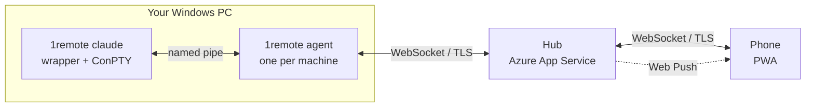

# 1RemoteCLI

**Answer your terminal from your phone.**

You start `claude` on a long refactor, leave your desk, and twenty minutes later it is sitting on *"Do you want me to apply these changes? (y/n)"* — and has been for nineteen of them.

1RemoteCLI attaches your phone to a terminal session already running on your Windows machine. Read the output, answer the prompt, send Ctrl+C, walk away again. Your phone buzzes when a session needs you.

```powershell
1remote claude          # exactly like running claude, but now visible from your phone
```

## Try it

```powershell
irm https://raw.githubusercontent.com/eranyariv/1RemoteCLI/main/scripts/install.ps1 | iex
```

Then, in a new terminal:

```powershell
1remote login           # sign in
1remote claude          # share a session
```

Then open the app on your phone and tap the session. Full walkthrough: **[docs/getting-started.md](docs/getting-started.md)**.

## Documentation

| | |
| --- | --- |
| [Getting started](docs/getting-started.md) | Install, sign in, first session |
| [Using it from your phone](docs/phone-setup.md) | Home screen, notifications, driving a session |
| [Troubleshooting](docs/troubleshooting.md) | When it does not work |
| [Security](docs/security.md) | **Read before pointing it at a machine that matters** |
| [Deployment](docs/deployment.md) · [Azure setup](docs/azure-setup.md) | Running the service |
| [Design spec](specs/1RemoteCLI-design-spec.md) | How and why it works the way it does |

## How it works



The wrapper runs your program under a real ConPTY, so it behaves exactly as it would unwrapped — same colours, same keys, same exit code. The agent keeps a headless VT emulator per session, which is what lets a phone attach mid-flight and immediately see the current screen instead of a blank terminal.

Both sides dial out to the hub, so nothing on your PC has to be reachable from the internet and no ports are opened. The hub is a stateless relay; the phone app is served from the same origin.

## Building it

```powershell
dotnet build 1RemoteCLI.slnx        # wrapper, agent, hub
dotnet test 1RemoteCLI.slnx
cd src\PWA; npm ci; npm test        # phone app
```

Packaging and deployment:

```powershell
.\scripts\publish-agent.ps1         # -> artifacts\win-x64\1remote.exe
.\scripts\publish-hub.ps1           # build the app into the hub and deploy it
```

Releasing the agent is a tag — `git push origin v0.2.0` builds both architectures and publishes them with their hashes. See [Deployment](docs/deployment.md#release-the-agent).

## Status

v1. Windows 10 2004+ on the desk, iOS 16.4+ or Android in your pocket. macOS support and richer agent-chat integrations are tracked in [issues](https://github.com/eranyariv/1RemoteCLI/issues).
