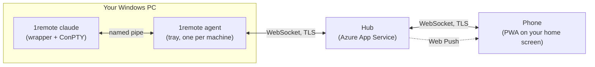

# 1RemoteCLI documentation

Attach your phone to a terminal session that is already running on your Windows machine — read the output, answer the prompt, send Ctrl+C — and then walk away again.

The problem it solves: you start `claude` on a long refactor, leave your desk, and twenty minutes later it is sitting on *"Do you want me to apply these changes? (y/n)"* and has been for nineteen of them.

## Read these in order

| | |
| --- | --- |
| **[Getting started](getting-started.md)** | Install, sign in, share your first session. Start here. |
| **[Using it from your phone](phone-setup.md)** | Add the app to your home screen, turn on notifications, drive a session. |
| **[Troubleshooting](troubleshooting.md)** | When the agent will not connect, a machine will not appear, or notifications never arrive. |
| **[Device matrix](device-matrix.md)** | The manual walkthrough for validating a real phone. |
| **[Security and what you are agreeing to](security.md)** | Read this before you point it at a machine that matters. It is short and it is honest. |

## If you are running the service, not just using it

| | |
| --- | --- |
| **[Deployment](deployment.md)** | Deploy the hub, configure it, add someone to the allowlist, ship a new `1remote.exe`. |
| **[Azure setup](azure-setup.md)** | The one-time app registration and resource provisioning, from zero. |
| **[Logging](logging.md)** | Where the logs are and how to turn the volume up. |
| **[Implementation plan](implementation-plan.md)** | The stages and tasks v1 was built from. |

The full design is in [`specs/1RemoteCLI-design-spec.md`](../specs/1RemoteCLI-design-spec.md).

## The shape of it in one picture

Three pieces, one binary. `1remote.exe` is the wrapper *and* the agent; which one you get depends on the command. The hub is a relay in Azure that both sides dial out to, so nothing has to be reachable from the internet and no ports are opened on your PC.

## Things to know before you rely on it

These are deliberate v1 limitations, not bugs. Knowing them up front saves an afternoon:

- **You have to remember to type `1remote`.** A terminal you already started cannot be adopted.
- **The session dies with the window it started in.** Close the terminal at your desk and the session ends, on the phone too.
- **The machine is only reachable while you are logged on.** The agent runs as you, so a rebooted PC sitting at the lock screen shows nothing.
- **No scrollback on the phone.** You see the current screen. Full scrollback stays at your desk.
- **A hub restart silently stops notifications** until each phone opens the app once — push subscriptions are held in memory. If everyone's notifications stop at the same moment, this is why.
- **The relay sees your terminal in plaintext.** See [Security](security.md); this one deserves a decision, not a shrug.

The full list, with the reasoning and the path forward for each, is §9 of the [design spec](../specs/1RemoteCLI-design-spec.md).
